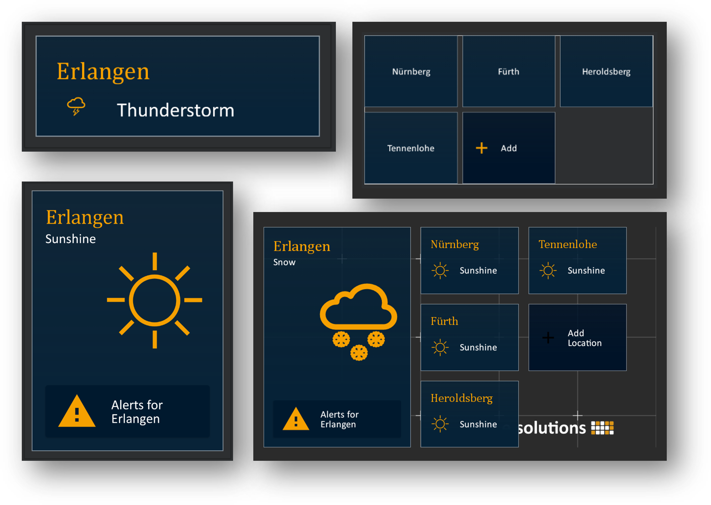

# Sample Weather Compose

This projects contains an Android weather application, developed with the new UI framework [Jetpack Compose](https://developer.android.com/jetpack/compose).
The goal is to highlight the most innovative features and the improved developer experience compared to the View & XML approach in Android.

Contents of this project are used to present Jetpack Compose, and its opportunities for app development, at conferences or other tech orientated sessions.

The project contains a small amount of business logic within the `domain` package.
Inside the `ui` package resides all of the Jetpack Compose implementation, which is the major part of the application source code. 

## Dynamic Theming

The app demonstrates how easy it is to develop a dynamic application theming using Compose foundation APIs.
With a few lines of code you can make your theme customizable by any app user:

```kotlin
@Composable
fun WeatherApp() {
    var activeColorPalette by remember { mutableStateOf(ColorPalettes.DarkBlue) }
    var activeDimensionScale by remember { mutableStateOf(1.0f) }
    
    WeatherTheme(
        colorPalette = activeColorPalette,
        dimensionScale = activeDimensionScale
    ) {
        AppContent(
            onColorPaletteSelected = { activeColorPalette = it },
            onSizeSelected = { activeDimensionScale = it}
        )
    }
}
```

You can find the dynamic theme implementation within the `WeatherActivity` inside the `de.eso.weather.ui` package.


## Slot APIs

Jetpack Compose leverages designing UI elements with dynamic content to the next level.
What was previously a pain to implement is now straight forward by using [slot APIs](https://developer.android.com/jetpack/compose/layouts/basics#slot-based-layouts).

For example for individual content of a `Button`:

```kotlin
Button(onClick = { }) {
    Image(Icons.Filled.Brush, null)
}

Button(onClick = { }) {
    Text("Sunshine")
}

Button(onClick = { }) {
    Image(Icons.Filled.Brush, null)
    Text("Sunshine")
}
```

## Android Studio Previews

With Jetpack Compose it is very simple to create a [preview in Android Studio](https://developer.android.com/jetpack/compose/tooling/previews) for all of your UI elements.



You can also take it a step further and create a `@Preview` for entire app screens, with different style characteristics:


